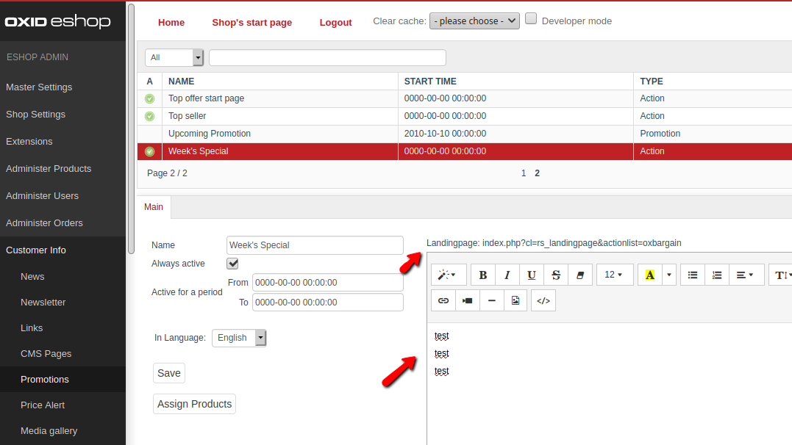
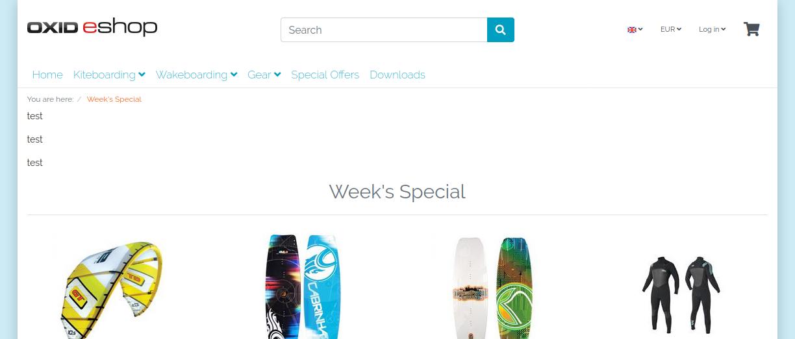

# Oxid Landingpage

Module based on code of https://github.com/ssemiz/Cookbook-OXID

## Description

Allow you to create a langing page with a content area on top. 
On the same page you can display products of a promotion.

Module was created for Oxid 6.1

## Installation

1. Copy files into following directory
        
        source/modules/rs/landingpage
        
2. Add to composer.json at shop root
  
        "autoload": {
            "psr-4": {
                "rs\\landingpage\\": "./source/modules/rs/landingpage"
            }
        },

3. Refresh autoloader files with composer.

        composer dump-autoload
        
5. Enable module in the oxid admin area, Extensions => Modules

## Usage

After the installation the new page type "rs_landingpage" is available.
It requires also the parameter "actionlist" with an OxId of a promotion object.
For simple usage, the link will display above the promotion area.

example:

    index.php?cl=rs_landingpage&actionlist=oxnewest

You could easily get nice URLs if you enter them in the backend at

    Master Settings > Core Settings > SEO > Static URLs

